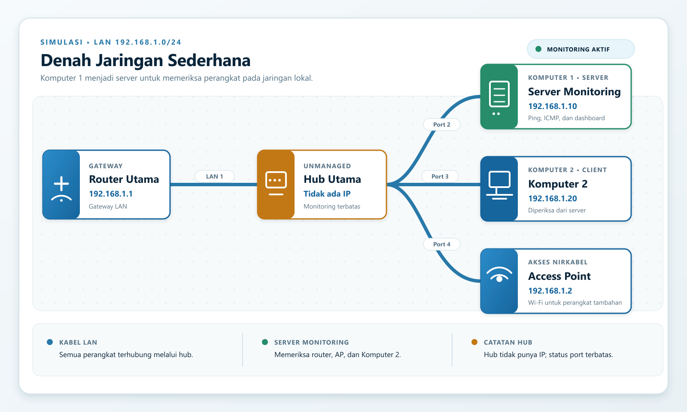

# Denah jaringan sederhana

Contoh ini memakai satu LAN `192.168.1.0/24`:

| Perangkat | Alamat contoh | Fungsi |
| --- | --- | --- |
| Router Utama | `192.168.1.1` | Gateway LAN dan DHCP |
| Access Point | `192.168.1.2` | Akses Wi-Fi |
| Server Monitoring / Komputer 1 | `192.168.1.10` | Menjalankan aplikasi monitoring |
| Komputer 2 | `192.168.1.20` | Client yang diperiksa |
| Hub Utama | Tidak ada IP | Penghubung fisik unmanaged |

## Cara memasang

1. Sambungkan port LAN router ke hub.
2. Sambungkan Komputer 1, Komputer 2, dan access point ke hub.
3. Berikan alamat IP sesuai tabel atau buat DHCP reservation pada router.
4. Pada Komputer 1, jalankan aplikasi monitoring dan `node_exporter` pada port `9100`.
5. Pastikan firewall mengizinkan ICMP dari server ke `192.168.1.1`, `192.168.1.2`, dan `192.168.1.20`.
6. Jika router dan access point mendukung SNMP, tambahkan kredensial read-only agar port, bandwidth, dan LLDP/CDP dapat ditemukan.

Saat database aplikasi masih kosong, bootstrap otomatis membuat perangkat dan empat koneksi contoh ini. Hub tetap ditampilkan pada topologi, tetapi tidak diping karena hub unmanaged tidak memiliki IP. Server hanya dapat mendeteksi perangkat pada LAN yang dapat dirouting dan dijangkau; perangkat di luar jaringan ini memerlukan route, VPN, atau router tambahan.
