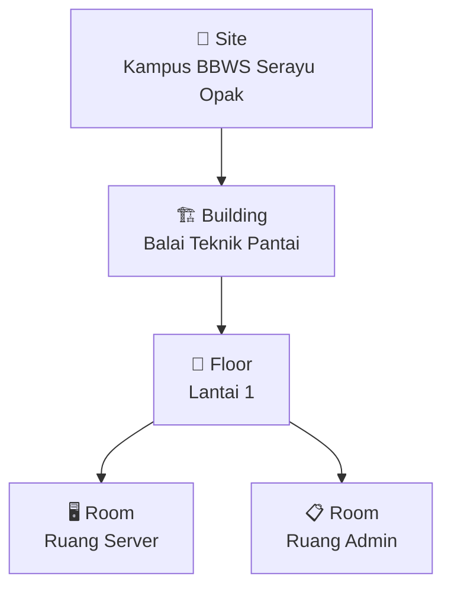

# 📍 Panduan Peta Lokasi & Denah Ruangan

> Dokumen ini menjelaskan **konsep**, **hierarki**, dan **langkah-langkah** pengisian data
> pada halaman **Peta Lokasi** (`/peta`) di aplikasi Monitora.

---

## 1. Konsep Dasar

Halaman Peta Lokasi berfungsi untuk memetakan **posisi fisik perangkat** jaringan
(router, switch, CCTV, server, dsb.) ke dalam denah gedung. Tujuannya agar teknisi
dapat langsung melihat perangkat mana yang bermasalah berdasarkan lokasi fisiknya,
tanpa harus membaca detail jaringan terlebih dahulu.

### 1.1 Hierarki Lokasi

Sistem menggunakan hierarki **4 level** yang bersifat **wajib berurutan**:

```
Site  ──▶  Building (Gedung)  ──▶  Floor (Lantai)  ──▶  Room (Ruang)
```



| Level        | Keterangan                                              | Contoh                    |
| ------------ | ------------------------------------------------------- | ------------------------- |
| **Site**     | Kompleks/kampus terluar. Induk dari semua gedung.       | Kampus BBWS Serayu Opak   |
| **Building** | Gedung fisik di dalam site.                             | Balai Teknik Pantai       |
| **Floor**    | Lantai di dalam gedung. **Denah di-upload di sini.**    | Lantai 1                  |
| **Room**     | Ruang di dalam lantai. **Perangkat di-assign di sini.** | Ruang Server, Ruang Admin |

> [!IMPORTANT]
> **Denah (gambar) di-upload di level LANTAI, bukan per-ruang.**
> Satu gambar denah lantai menunjukkan seluruh ruangan pada lantai tersebut.

> [!IMPORTANT]
> **Perangkat di-assign ke level RUANG.**
> Setiap perangkat harus masuk ke salah satu ruang agar bisa diletakkan di denah.

---

## 2. Alur Kerja Lengkap

### Langkah 1 — Buat Hierarki Lokasi

Buka halaman `/peta`, lalu klik tombol **"Atur lokasi & denah"** di pojok kanan atas.

#### 1a. Buat Site

| Field  | Nilai                   |
| ------ | ----------------------- |
| Jenis  | `Site`                  |
| Nama   | Kampus BBWS Serayu Opak |

Klik **Tambah lokasi**.

#### 1b. Buat Gedung

| Field  | Nilai                   |
| ------ | ----------------------- |
| Jenis  | `Gedung`                |
| Induk  | Kampus BBWS Serayu Opak |
| Nama   | Balai Teknik Pantai     |

Klik **Tambah lokasi**.

#### 1c. Buat Lantai

| Field  | Nilai               |
| ------ | ------------------- |
| Jenis  | `Lantai`            |
| Induk  | Balai Teknik Pantai |
| Nama   | Lantai 1            |

Klik **Tambah lokasi**.

#### 1d. Buat Ruang-ruang

Ulangi untuk setiap ruang yang ada di lantai tersebut:

| Field  | Ruang 1       | Ruang 2     |
| ------ | ------------- | ----------- |
| Jenis  | `Ruang`       | `Ruang`     |
| Induk  | Lantai 1      | Lantai 1    |
| Nama   | Ruang Server  | Ruang Admin |

Klik **Tambah lokasi** untuk masing-masing.

---

### Langkah 2 — Upload Gambar Denah

Masih di panel **"Atur lokasi & denah"**:

1. Di panel kiri (Lokasi), **klik "Lantai 1"** agar terpilih.
2. Scroll ke bagian **"Unggah denah lokasi terpilih"**.
3. Pilih file gambar denah lantai (format: **PNG, JPG, atau WebP**, maks **10 MB**).
4. Klik **Unggah denah**.

> [!TIP]
> Gambar denah sebaiknya menunjukkan **seluruh tata letak lantai** beserta
> semua ruangan di dalamnya. Gunakan gambar dengan resolusi tinggi agar
> detail ruangan terlihat jelas saat diperbesar.

Setelah upload berhasil, tutup panel pengaturan. Anda akan melihat gambar denah
muncul di panel tengah halaman.

---

### Langkah 3 — Assign Perangkat ke Ruang

Buka halaman **Perangkat** (`/perangkat`), lalu edit setiap perangkat:

1. Pada field **"Ruang"**, pilih ruang yang sesuai (misal: `Ruang Server`).
2. Simpan perubahan.

Perangkat yang sudah di-assign ke ruang akan muncul di panel **"Belum ditempatkan"**
pada halaman Peta Lokasi.

---

### Langkah 4 — Tempatkan Perangkat di Denah

Kembali ke halaman `/peta`:

1. Di panel kiri, pastikan **"Lantai 1"** terpilih sehingga denah terlihat.
2. Di panel kanan (**"Belum ditempatkan"**), klik perangkat yang ingin ditempatkan.
3. **Klik pada posisi yang tepat** di gambar denah lantai.
4. Perangkat akan muncul sebagai ikon di posisi tersebut.

> [!TIP]
> Anda juga bisa **drag & drop** perangkat dari panel kanan langsung ke
> gambar denah. Perangkat yang sudah ditempatkan juga bisa di-drag untuk
> memindahkan posisinya.

---

## 3. Tampilan Akhir

Setelah semua langkah selesai, halaman Peta Lokasi akan menampilkan:

```
┌──────────────────────────────────────────────────────────────────────┐
│                    🗺️ Peta Google Maps (Interaktif)                 │
│                    📐 Denah 1 Lantai 2 Ruangan                      │
├────────────┬─────────────────────────────────┬───────────────────────┤
│  LOKASI    │         DENAH LANTAI 1          │  BELUM DITEMPATKAN    │
│            │                                 │                       │
│  ▸ Site    │   ┌─────────┬─────────────┐     │  (kosong jika semua   │
│    ▸ Gedung│   │  Ruang  │   Ruang     │     │   sudah dipetakan)    │
│      ▸ Lt 1│   │  Server │   Admin     │     │                       │
│        R.1 │   │  [SW]   │   [RT]      │     │                       │
│        R.2 │   │  [SRV]  │   [AP]      │     │                       │
│            │   └─────────┴─────────────┘     │                       │
│            │                                 │                       │
│            │  ● Sehat  ● Perhatian  ● Error  │                       │
└────────────┴─────────────────────────────────┴───────────────────────┘
```

---

## 4. Status Perangkat di Denah

Setiap perangkat yang ditempatkan di denah memiliki warna status:

| Warna    | Status            | Keterangan                                |
| -------- | ----------------- | ----------------------------------------- |
| 🟢 Hijau | Sehat (Healthy)   | Perangkat online dan berfungsi normal.    |
| 🟡 Kuning| Perlu Perhatian   | Ada warning, perlu dicek.                 |
| 🔴 Merah | Bermasalah        | Perangkat offline atau ada error kritis.  |
| ⚪ Abu   | Belum Diketahui   | Status belum bisa ditentukan.             |

Klik ikon perangkat di denah untuk membuka **detail kesehatan** perangkat tersebut
(drawer di sisi kanan).

---

## 5. Mengganti Gambar Placeholder

Saat ini, aplikasi menggunakan gambar placeholder untuk peta dan denah.
Untuk menggantinya dengan gambar asli:

### Peta Geografis
Peta sudah menggunakan **Google Maps embed** yang interaktif. Jika ingin
mengubah lokasi pencarian, edit file berikut:

**File:** `frontend/app/peta/page.tsx`

Cari baris:
```tsx
src="https://maps.google.com/maps?q=Balai%20Teknik%20Pantai&t=&z=15..."
```

Ganti `Balai%20Teknik%20Pantai` dengan nama lokasi atau koordinat yang diinginkan.

### Denah Ruangan
Ganti file gambar di:

```
frontend/public/denah-ruangan.jpg
```

Replace dengan gambar denah asli Anda (format JPG/PNG/WebP).

---

## 6. Catatan Teknis

> [!NOTE]
> **Data Mock (Dummy)**
>
> Jika database lokasi masih kosong, sistem akan menampilkan data contoh:
> - Kampus BBWS Serayu Opak → Balai Teknik Pantai → Lantai 1 → Ruang Server & Ruang Admin
>
> Data ini akan **otomatis hilang** begitu Anda menambahkan lokasi sungguhan
> melalui fitur "Atur lokasi & denah". Data mock didefinisikan di
> `frontend/app/peta/page.tsx` dalam fungsi `load()`.

> [!WARNING]
> **Hak Akses**
>
> Hanya user dengan role **admin** yang bisa:
> - Menambah/mengubah/menghapus lokasi
> - Meng-upload denah
> - Menempatkan perangkat di denah
>
> User dengan role **viewer** hanya bisa melihat.

---

## 7. FAQ

### Q: Apakah saya harus upload denah per-ruang?
**Tidak.** Upload 1 gambar denah per **lantai**. Gambar tersebut harus menunjukkan
seluruh layout lantai termasuk semua ruangan.

### Q: Bagaimana jika gedung punya banyak lantai?
Buat beberapa entry `Lantai` (Lantai 1, Lantai 2, dst.) di bawah gedung yang sama.
Upload denah untuk **masing-masing lantai**.

### Q: Apa yang terjadi jika saya menghapus lantai?
Lantai hanya bisa dihapus jika **tidak ada ruang** di dalamnya. Hapus semua
ruang terlebih dahulu.

### Q: Perangkat tidak muncul di panel "Belum ditempatkan"?
Pastikan perangkat sudah di-assign ke **ruang** yang berada di bawah lantai
yang sedang Anda pilih di panel kiri.
